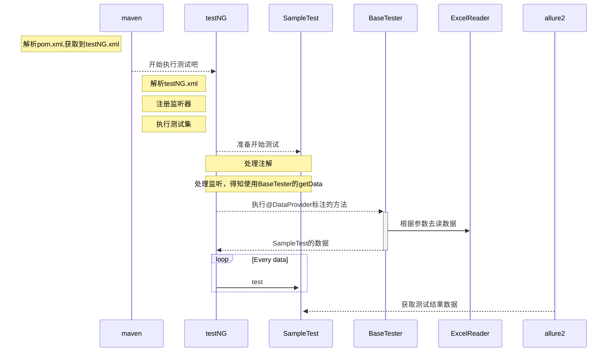

----------

> 先搭建java接口测试的环境：
> - 使用mvn命令构建项目
> - 测试集通过testNG.xml组织并运行
> - 测试数据解耦，通过Excel等文件提供
> 1. 基础依赖
>     - 创建maven项目(包含一些基础的插件，见pom.xml)
>     - 引入testNG测试框架
>     - 引入allure报告框架
>     - 其他日志等依赖引入
> 2. 测试依赖待开发
>     - 测试基类(统一数据提供方法)
>     - Excel读取工具类
>     - 注解与监听类

[toc]

## 1. 基础环境

- java版本：1.8.0_191
- IDEA
- maven：Apache Maven 3.6.0
- allure2：2.10.0

**allure安装**

- 随项目一起放到项目根目录.allure目录，可以参考官方给出的项目示例：[参考地址](https://github.com/allure-framework)
- allure2可以直接去官方github下载：[下载地址](https://github.com/allure-framework/allure2/releases)

## 2. 项目结构




## 3. 代码开发

### 3.1 Excel读取

Excel读取直接按照规定的方法读取数据：
1. 未指定sheet，默认读取Sheet1。
2. 指定Sheet名称读取到无空白标题或空白行隔断的所有数据。
3. 指定Sheet名称与locate(一个定位器，也就是一个cell的值)，从这个cell开始读取到无空白标题或空白行隔断的所有数据。
4. 指定Name读取Name区域的所有数据。==name就是Excel的名称，需要工作簿范围的名称 #F44336==
5. 所有读取方式都会默认跳过定位到的区域前两行。如：name定位到第2行第2列开始，会从第2行为可备注等随意填写数据区域，第3行为列名，第四行开始为数据。

**name定义方法**:
1. 选中区域，鼠标右键定义名称，
2. 公式 -> 名称管理器 -> 新建

定义的名称可左上角点击直接跳到指定区域，或通过名称管理器


``` java
package per.hao.utils;

import org.apache.poi.hssf.usermodel.HSSFWorkbook;
import org.apache.poi.ss.usermodel.*;
import org.apache.poi.xssf.usermodel.XSSFWorkbook;
import org.slf4j.Logger;
import org.slf4j.LoggerFactory;

import java.io.*;
import java.util.*;
import java.util.regex.Matcher;
import java.util.regex.Pattern;

public class ExcelReader implements Iterator<Object[]> {

    private static final Logger logger = LoggerFactory.getLogger(ExcelReader.class);

    private static final char[] LETTER = "ABCDEFGHIJKLMNOPQRSTUVWXYZ".toCharArray();

    private InputStream in = null;
    private Workbook workbook = null;
    private Sheet sheet = null;

    /* 当前行id 列id */
    private int curRowNum = 1;
    private int curColNum = 0;

    /* 当前工作表中可读最大行 */
    private int maxRowNum = 0;
    private int maxColNum = 0;

    /* 读取行列数量记录 */
    private int readRowNum = 0;
    private int readColNum = 0;

    /* 列名记录 */
    List<String> colNames = new ArrayList<>();


    /**
     * 根据sheetName初始化
     *
     * @param filePath excel文件路径
     * @param sheetName 读取的sheet名称
     * */
    public static ExcelReader getDataBySheetName(String filePath, String sheetName) {
        return new ExcelReader(filePath, sheetName, "", "", 1);
    }

    /**
     * 根据定位器初始化
     *
     * @param filePath excel文件路径
     * @param sheetName 读取的sheet名称
     * @param locate 定位器名称
     * */
    public static ExcelReader getDataByLocate(String filePath, String sheetName, String locate) {
        return new ExcelReader(filePath, sheetName, locate, "", 2);
    }

    /**
     * 根据名称初始化
     *
     * @param filePath excel文件路径
     * @param Name 名称
     * */
    public static ExcelReader getDataByName(String filePath, String Name) {
        return new ExcelReader(filePath, "", "", Name, 3);
    }


    /**
     * 私有构造方法
     *
     * @param filePath excel文件路径
     * @param sheetName 读取的sheet名称
     * @param locate 定位器名称
     * @param name 名称
     * @param type 初始化的类型
     *
     * 根据type的值来确定初始化的方法
     *             1 ： 根据sheetName初始化， filePath、sheetName不为空
     *             2 ： 根据定位器初始化， filePath、sheetName、 locate不为空
     *             3 ： 根据名称初始化， name不为空
     * */
    private ExcelReader(String filePath, String sheetName, String locate, String name, int type) {
        initWorkBook(filePath);
        if (type == 1) {// 根据sheetName初始化
            initSheet(filePath, sheetName);
            initParam();
            ininColumnName();
        } else if (type == 2) {// 根据定位器初始化
            initSheet(filePath, sheetName);
            initParam();
            registerLocate(locate);
            ininColumnName();

        } else if (type == 3) {// 根据名称初始化
            initByName(filePath, name);
        }
    }

    /**
     * 根据名称初始化当前读取区域定位信息
     *
     * @param filePath excel路径
     * @param designation 名称
     *
     * 读取到的名称需要是工作簿作用范围，匹配定位信息初始化curColNum、 curRowNum、maxColNum、maxRowNum
     * */
    private void initByName(String filePath, String designation) {
        Name name = workbook.getName(designation);
        if (name != null) {
            initSheet(filePath, name.getSheetName());

            /* 根据excel定位字符串初始化名称区域 */
            Matcher matcher = Pattern.compile("^.*?\\$(\\w+)\\$(\\d+):\\$(\\w+)\\$(\\d+)$")
                    .matcher(name.getRefersToFormula());
            if (matcher.find()) {
                curColNum = letterToDec(matcher.group(1));
                curRowNum = Integer.parseInt(matcher.group(2));
                maxColNum = letterToDec(matcher.group(3));
                maxRowNum = Integer.parseInt(matcher.group(4));
            } else {
                logger.error("cannot find coordinate: {}", name.getRefersToFormula());
            }

            ininColumnName();

        } else {
            logger.error("cannot find name: {}", designation);
        }

    }

    /**
     * 将Excel列定位字母转换为数字
     * 从0开始，A -> 0, AA -> 26, BA -> 53以此类推, 也就是特殊的26进制
     *
     * @param letterCoordinate 列
     *
     * @return int
     * */
    private int letterToDec(String letterCoordinate) {
        char[] cs = letterCoordinate.toCharArray();
        int decIndex = 0, i = 0;

        for (; i < cs.length; i++) {
            decIndex += Math.pow(26, (cs.length - i - 1)) * (Arrays.binarySearch(LETTER, cs[i]) + 1);
        }

        return decIndex - 1;// 从0开始 减1
    }

    /**
     * 初始化列名
     * */
    private void ininColumnName() {
        Row colNameRow = sheet.getRow(curRowNum);

        /* 遇到空的cell读取结束 */
        for (int i = 0; i < colNameRow.getLastCellNum(); i++) {
            String cellContents = getCellContents(colNameRow.getCell(i));
            if (!"".equals(cellContents)) {
                colNames.add(cellContents);
            } else {
                logger.debug("Read to blank cell default read column end");
                break;
            }
        }
        curRowNum ++;
    }


    /**
     * 根据定位器初始化当前行
     *
     * @param locate 定位器
     * */
    private void registerLocate(String locate) {
        /* 至少存在1列 */
        if (maxColNum >= 1) {
            boolean flag = false;// 默认无定位器

            for (int i = 0; i < sheet.getLastRowNum(); i++) {
                Row row = sheet.getRow(i);

                if (row == null) { continue; }

                Cell cell = row.getCell(0);

                /* 找到定位器，初始化当前读取位置 */
                if (locate.equals(getCellContents(cell))) {
                    flag = true;
                    curRowNum = cell.getAddress().getRow() + 1;// 从定位器下一行开始
                }

                if (flag) {
                    logger.info("find locate point, read from next line");
                } else {
                    logger.info("cannot find locate point, read from default line");
                }
            }
        }

    }

    /**
     * 初始化部分变量
     *
     * */
    private void initParam() {
        maxRowNum = sheet.getLastRowNum() + 1;
        maxColNum = sheet.getLastRowNum();
        readColNum = colNames.size();
    }

    /**
     * 根据Sheet名称获取Sheet
     *
     * @param sheetName sheet名称
     * */
    private void initSheet(String filePath, String sheetName) {
        /* 获取WorkBook 中的sheet */
        if (workbook != null) {
            sheet = workbook.getSheet(sheetName);
        } else {
            logger.error("WorkBook Object dose not exist!");
        }

        /* sheet未获取到 */
        if (sheetName == null) {
            logger.error("In {} sheet does not exist", filePath);
        } else {
            logger.info("read sheet: {}", sheetName);
        }
    }

    /**
     * 根据后缀判断版本获取excel对象
     *
     * @param filePath 文件路径
     * */
    private void initWorkBook(String filePath) {
        try {
            in = new BufferedInputStream(new FileInputStream(filePath));
        /* 2003 Excel */
        if (filePath.endsWith(".xls")) {
            workbook = new HSSFWorkbook(in);
        /* 2007 Excel */
        } else if (filePath.endsWith(".xlsx")) {
            workbook = new XSSFWorkbook(in);
        } else {
            logger.error("File is not Excel File: {}", filePath);
        }
        } catch (FileNotFoundException e) {
            logger.error("File not found: ", e);
        } catch (IOException e) {
            logger.error("Create WorkBook failed: ", e);
        }

        // 设置默认返回空串
        workbook.setMissingCellPolicy(Row.MissingCellPolicy.CREATE_NULL_AS_BLANK);
        logger.info("read excel: {}", filePath);
    }

    /**
     * 判断是否为空行
     * */
    private boolean judgeblankRow(Row row) {
        for (int i = 0; i < row.getLastCellNum(); i++) {
            Cell cell = row.getCell(i);
            /* 存在单元格不为空字符串则为非空行 */
            if (!"".equals(getCellContents(cell))) {
                return false;
            }
        }
        return true;
    }

    /**
     * 关闭资源
     * */
    private void close() {
        if (in != null) {
            try {
                in.close();
            } catch (IOException e) {
                logger.error("close file filed", e);
            }
        }
    }

    /**
     * 判断是否存在下一行
     *
     * 如果下一行为空行 @return true
     * 如果下一行为非空行 @return false
     * */
    @Override
    public boolean hasNext() {
        if (curRowNum < maxRowNum) {
            Row curRow = sheet.getRow(curRowNum);
            if (judgeblankRow(curRow)) {
                return false;
            }
            return true;
        }
        return false;
    }

    /**
     * 获取下一行数据
     *
     * @return Object[]数组对象
     * */
    @Override
    public Object[] next() {
        Map<String, String> curRowData = new HashMap<>();

        Row curRow = sheet.getRow(curRowNum);
        /* 根据列名取对应列数据 */
        for (int i = curColNum; i < colNames.size(); i++) {
            Cell cell = curRow.getCell(i);
            curRowData.put(colNames.get(i), getCellContents(cell));
        }

        readRowNum ++;
        curRowNum ++;

        return new Object[] { curRowData };
    }

    /**
     * 以String类型返回值
     *
     * */
    private String getCellContents(Cell cell) {
        cell.setCellType(CellType.STRING);
        return cell.getStringCellValue();
    }

    @Override
    public void remove() {
        logger.error("not support remove");
    }
}

```

### 3.2 数据提供与监听器

1. testNG提供了DataProvider注解来指定数据提供接口，这里定义一个BaseTester类添加一个公共的getData方法作为公共的数据提供接口。
2. 读取数据需要指定dataProvider="名称"，使用监听器将dataProvider指定为默认的。
3. 定义自己的DataSource注解，定义文件路径、sheetName等参数，在getData方法被调用的时候解释DataSource注解内参数来去读指定数据。


#### 3.2.1 BaseTester测试基类

在测试类中extends BaseTester

``` java
package per.hao;

import org.slf4j.Logger;
import org.slf4j.LoggerFactory;
import org.testng.annotations.DataProvider;
import per.hao.annotations.DataSource;
import per.hao.utils.DataSourceType;
import per.hao.utils.ExcelReader;

import java.io.File;
import java.lang.reflect.Method;
import java.util.Iterator;
import java.util.regex.Matcher;


public class BaseTester {

    public static final Logger logger =
            LoggerFactory.getLogger(BaseTester.class);

    /**
     * 数据提供公共接口
     * */
    @DataProvider(name = "getData")
    public static Iterator<Object[]> getData(Method method) {

        DataSource dataSource = null;

        /** 数据源注解存在判断 */
        if (method.isAnnotationPresent(DataSource.class)) {
            dataSource = method.getAnnotation(DataSource.class);
        } else {
            logger.error("未指定@DataSource注解却初始化了dataProvider");
        }

        /** 根据数据源类型返回对应数据迭代器 */
        if (DataSourceType.CSV
                .equals(dataSource.dataSourceType())) {

            // CSVReader

        } else if (DataSourceType.POSTGRESQL
                .equals(dataSource.dataSourceType())) {

            // PostgresqlReader

        }

        /* 默认读取excel */
        // 根据名称
        if (!"".equals(dataSource.name())) {

            return ExcelReader.getDataByName(
                    dealFilePath(dataSource.filePath()), dataSource.name());
            // 根据锚点
        } else if (!"".equals(dataSource.locate())) {

            return ExcelReader.getDataByLocate(
                    dealFilePath(dataSource.filePath()), dataSource.sheetName(), dataSource.locate());
           // 读取整个sheet页
        } else {

            return ExcelReader.getDataBySheetName(
                    dealFilePath(dataSource.filePath()), dataSource.sheetName());

        }
    }

    /**
     * 如果只存在文件名，则拼接默认读取目录，否则使用指定的路径
     *
     * @param filePath 文件路径
     * */
    private static  String dealFilePath(String filePath) {
        if (!filePath.matches(".*[/\\\\].*")) {
            filePath = "src/test/resources/data/" + filePath;
        }

        return new File(filePath.replaceAll("[/\\\\]+",
                Matcher.quoteReplacement(File.separator))).getAbsolutePath();
    }
}

```

#### 3.2.2 DataSourceListener监听器


1. **DataSourceListener** 

``` java
package per.hao.listener;

import org.slf4j.Logger;
import org.slf4j.LoggerFactory;
import org.testng.IAnnotationTransformer;
import org.testng.annotations.ITestAnnotation;
import per.hao.BaseTester;
import per.hao.annotations.DataSource;

import java.lang.reflect.Constructor;
import java.lang.reflect.Method;

/**
 * 监听测试是否存在{@code DataSource.CLASS}注解:
 * 1. 如果存在@DataSource注解且@Test注解中未对dataProvider赋值
 *    则指定{@code BaseTester.CLASS}中提供的getData数据提供者方法
 * 2. 如果不存在@DataSource注解或@Test注解中已经对dataProvider赋值
 *    则不修改dataProvider
 *
 * 测试方法@Test注解dataProviderClass如果值为Object.class则修改
 * 为BaseTest.class
 * */
public class DataSourceListener implements IAnnotationTransformer {

    private static final Logger logger = LoggerFactory.getLogger(DataSourceListener.class);

    /**
     * 本监听的入口，监听每次测试方法的调用，并设置相应参数
     *
     * @param iTestAnnotation 提供对@Test注解操作的对象
     * @param aClass
     * @param constructor
     * @param method 本次触发监听的测试方法
     * */
    @Override
    public void transform(ITestAnnotation iTestAnnotation, Class aClass, Constructor constructor, Method method) {
        // 测试为null
        if (iTestAnnotation == null || method == null) {
            return;
        }

        /** 判断并修改@Test注解 dataProvider 值 */
        modifyDataProvider(iTestAnnotation, method);

        /** 判断并修改@Test注解 dataProviderClass 值 */
        if (iTestAnnotation.getDataProviderClass() == null) {
            iTestAnnotation.setDataProviderClass(BaseTester.class);
            logger.debug("dataProviderClass设置为: {}", BaseTester.class);
        } else {
            logger.debug("dataProviderClass已经指定: {}", iTestAnnotation.getDataProviderClass());
        }
    }

    /**
     * 对@Test注解dataProvider数据提者判断修改的方法
     *
     * @param iTestAnnotation 提供对@Test注解操作的对象
     * @param method 本次触发监听的测试方法
     * */
    private void modifyDataProvider(ITestAnnotation iTestAnnotation, Method method) {

        /** 如果存在@DataSource注解 */
        if (method.isAnnotationPresent(DataSource.class)) {
            if ("".equals(iTestAnnotation.getDataProvider())) {
                iTestAnnotation.setDataProvider("getData");
                logger.debug("dataProvider设置为: getData");
            } else {
                logger.debug("dataProvider已指定: {}", iTestAnnotation.getDataProvider());
            }

        /* 未指定@DataSource注解却指定了dataProvider */
        } else if ((! method.isAnnotationPresent(DataSource.class)) &&
                ! "".equals(iTestAnnotation.getDataProvider())) {
            logger.error("未指定@DataSource注解却初始化了dataProvider");
        }
    }
}

```

2. **将监听器配置到testNG.xml中**

``` xml
    <listeners>
        <!-- 数据源监听(修改@Test注解中的部分配置) -->
        <listener class-name="per.hao.listener.DataSourceListener"/>
    </listeners>
```

#### 3.2.3 DataSource数据源注解

SQL与CSV方法目前没有写，先只写了Excel数据读取的工具类

``` java
package per.hao.annotations;

import per.hao.utils.DataSourceType;

import java.lang.annotation.*;

/**
 * 标注参数化数据源, 默认从提供Excel读取
 * */
@Documented
@Retention(RetentionPolicy.RUNTIME)
@Target(ElementType.METHOD)
public @interface DataSource {

    DataSourceType dataSourceType() default DataSourceType.EXCEL;

    String filePath() default "";

    String sheetName() default "Sheet1";// 除根据name外需要指定, 默认读取Sheet1

    String locate() default "";// 定位器, 左上角第一个cell(ReadExcel用)

    String name() default ""; // 可指定Excel名称读取

    String sql() default "";

}


```

## 4. 配置

### 4.1 pom.xml

``` xml
<?xml version="1.0" encoding="UTF-8"?>
<project xmlns="http://maven.apache.org/POM/4.0.0"
         xmlns:xsi="http://www.w3.org/2001/XMLSchema-instance"
         xsi:schemaLocation="http://maven.apache.org/POM/4.0.0 http://maven.apache.org/xsd/maven-4.0.0.xsd">
    <modelVersion>4.0.0</modelVersion>

    <groupId>per.hao</groupId>
    <artifactId>selenium-project-hzhang</artifactId>
    <version>1.0.0</version>

    <properties>
        <project.build.sourceEncoding>UTF-8</project.build.sourceEncoding>
        <allure.version>2.10.0</allure.version>
        <java.version>1.8</java.version>
        <aspectj.version>1.9.2</aspectj.version>
    </properties>

    <dependencies>

        <!-- testNG框架 -->
        <dependency>
            <groupId>org.testng</groupId>
            <artifactId>testng</artifactId>
            <version>6.14.3</version>
            <scope>test</scope>
        </dependency>

        <!-- allure报告依赖 -->
        <dependency>
            <groupId>io.qameta.allure</groupId>
            <artifactId>allure-testng</artifactId>
            <version>${allure.version}</version>
            <scope>test</scope>
        </dependency>
        <dependency>
            <groupId>io.qameta.allure</groupId>
            <artifactId>allure-maven</artifactId>
            <version>${allure.version}</version>
            <scope>test</scope>
        </dependency>
        <dependency>
            <groupId>org.hamcrest</groupId>
            <artifactId>hamcrest-all</artifactId>
            <version>1.3</version>
            <scope>test</scope>
        </dependency>

        <!-- 日志依赖 -->
        <!-- https://mvnrepository.com/artifact/org.slf4j/slf4j-api -->
        <dependency>
            <groupId>org.slf4j</groupId>
            <artifactId>slf4j-api</artifactId>
            <version>1.7.25</version>
            <scope>test</scope>
        </dependency>
        <!-- https://mvnrepository.com/artifact/org.slf4j/slf4j-log4j12 -->
        <dependency>
            <groupId>org.slf4j</groupId>
            <artifactId>slf4j-log4j12</artifactId>
            <version>1.7.25</version>
            <scope>test</scope>
        </dependency>

        <!-- excel读取插件 -->
        <!-- https://mvnrepository.com/artifact/org.apache.poi/poi -->
        <dependency>
            <groupId>org.apache.poi</groupId>
            <artifactId>poi</artifactId>
            <version>4.1.0</version>
            <scope>test</scope>
        </dependency>
        <!-- https://mvnrepository.com/artifact/org.apache.poi/poi-ooxml -->
        <dependency>
            <groupId>org.apache.poi</groupId>
            <artifactId>poi-ooxml</artifactId>
            <version>4.1.0</version>
            <scope>test</scope>
        </dependency>

    </dependencies>

    <build>

        <plugins>
            <plugin>
                <groupId>org.apache.maven.plugins</groupId>
                <artifactId>maven-surefire-plugin</artifactId>
                <version>2.22.1</version>
                <configuration>
                    <argLine>
                        -javaagent:"${settings.localRepository}/org/aspectj/aspectjweaver/${aspectj.version}/aspectjweaver-${aspectj.version}.jar"
                    </argLine>
                    <!-- 测试失败继续运行 -->
                    <testFailureIgnore>true</testFailureIgnore>
                    <!-- testNG用例集xml设置 -->
                    <suiteXmlFiles>
                        <suiteXmlFile>
                            src/test/resources/testng/testNG.xml
                        </suiteXmlFile>
                    </suiteXmlFiles>
                </configuration>
                <dependencies>
                    <dependency>
                        <groupId>org.aspectj</groupId>
                        <artifactId>aspectjweaver</artifactId>
                        <version>${aspectj.version}</version>
                    </dependency>
                </dependencies>
            </plugin>

            <!-- 构建插件, 指定版本与编码 -->
            <plugin>
                <groupId>org.apache.maven.plugins</groupId>
                <artifactId>maven-compiler-plugin</artifactId>
                <version>3.8.0</version>
                <configuration>
                    <source>1.8</source>
                    <target>1.8</target>
                    <encoding>utf-8</encoding>
                </configuration>
            </plugin>

        </plugins>
    </build>

    <reporting>
        <excludeDefaults>true</excludeDefaults>
        <plugins>
            <plugin>
                <groupId>io.qameta.allure</groupId>
                <artifactId>allure-maven</artifactId>
                <version>${allure.version}</version>
                <configuration>
                    <reportVersion>${allure.version}</reportVersion>
                </configuration>
            </plugin>
        </plugins>
    </reporting>
</project>
```

### 4.2 allure.properties

``` profile
allure.results.directory=target/allure-results
allure.link.issue.pattern=https://example.org/issue/{}
allure.link.tms.pattern=https://example.org/tms/{}
```

### 4.3 log4j.properties

``` profile
log4j.rootLogger=CONSOLE,FILE
log4j.addivity.org.apache=false

# 应用于控制台
log4j.appender.CONSOLE=org.apache.log4j.ConsoleAppender
log4j.appender.CONSOLE.Threshold=DEBUG
log4j.appender.CONSOLE.Target=System.out
log4j.appender.CONSOLE.Encoding=UTF-8
log4j.appender.CONSOLE.layout=org.apache.log4j.PatternLayout
log4j.appender.CONSOLE.layout.ConversionPattern=%d - %c -%-4r [%t] %-5p - %m%n

# 每天新建日志
log4j.appender.A1=org.apache.log4j.DailyRollingFileAppender
log4j.appender.A1.File=E:/log4j/log
log4j.appender.A1.Encoding=UTF-8
log4j.appender.A1.Threshold=DEBUG
log4j.appender.A1.DatePattern='.'yyyy-MM-dd
log4j.appender.A1.layout=org.apache.log4j.PatternLayout
log4j.appender.A1.layout.ConversionPattern=%d{ABSOLUTE} %5p %c{1}:%L : %m%n

#应用于文件
log4j.appender.FILE=org.apache.log4j.FileAppender
log4j.appender.FILE.File=E:/log4j/file.log
log4j.appender.FILE.Threshold=DEBUG
log4j.appender.FILE.Append=true
log4j.appender.FILE.Encoding=UTF-8
log4j.appender.FILE.layout=org.apache.log4j.PatternLayout
log4j.appender.FILE.layout.ConversionPattern=%d - %c -%-4r [%t] %-5p - %m%n
```

### 4.4 testNG.xml

``` xml
<?xml version="1.0" encoding="UTF-8"?>
<!DOCTYPE suite SYSTEM "http://testng.org/testng-1.0.dtd">
<suite name="MyProjectSuite" parallel="classes" thread-count="1">
    <test verbose="2" preserve-order="true" name="测试获取数据">
        <classes>
            <class name="per.hao.cases.SimpleTest" />
        </classes>
    </test>

    <listeners>
        <!-- 数据源监听(修改@Test注解中的部分配置) -->
        <listener class-name="per.hao.listener.DataSourceListener"/>
    </listeners>
</suite> <!-- Suite -->
```

## 5. 测试示例

### 5.1 SampleTest

``` java
package per.test;

import io.qameta.allure.*;
import org.testng.annotations.Test;
import per.hao.annotations.DataSource;
import java.util.Map;
import static io.qameta.allure.Allure.*;


public class SimpleTest extends DataSourceListener{

    @Test(description = "测试默认读取Sheet1")// 这个desciption是标题
    @Severity(SeverityLevel.CRITICAL)// 测试优先级
    @DataSource(filePath = "param.xlsx")
    @Description("在不指定Sheet名称的情况下，测试能否读取默认数据。")// 这个才是描述
    @Step("第一步先测试一下能否读取Sheet1中的数据")// 父步骤
    @Link(name = "默认读取Sheet1需求", url = "https://www.cnblogs.com/h-zhang/")// 需求
    @Issue("https://www.cnblogs.com/h-zhang/")// BUG
    public void simpleTest1(Map<String, String> row) {

        step("step 1: 获取用例数据");
        String caseName = row.get("用例名称");

        step("step 2: 返回实际结果" + caseName);
    }

    @Test(description = "测试指定Sheet名称读取")
    @DataSource(filePath = "param.xlsx", sheetName = "Sheet读取")
    public void simpleTest2(Map<String, String> row) {
        step("step 1: 获取用例数据");
        String caseName = row.get("用例名称");

        step("step 2: 返回实际结果" + caseName);
    }

    @Test(description = "测试指定名称读取")
    @DataSource(filePath = "param.xlsx", name = "测试name读取")
    public void simpleTest3(Map<String, String> row) {
        step("step 1: 获取用例数据");
        String caseName = row.get("用例名称");

        step("step 2: 返回实际结果" + caseName);
    }

    @Test(description = "测试指定locate读取")
    @DataSource(filePath = "param.xlsx", sheetName = "locate读取", locate = "I'm locate")
    public void simpleTest4(Map<String, String> row) {
        step("step 1: 获取用例数据");
        String caseName = row.get("用例名称");

        step("step 2: 返回实际结果" + caseName);
    }
}


```

### 5.2 测试运行

项目根目录下打开命令行：

``` shell
# 1. 运行测试
mvn clean test site
# 2. 生成报告
mvn io.qameta.allure:allure-maven:serve
```

### 5.3 报告示例

概览有地方没数据是因为没有历史记录，使用jenkins运行持续集成运行几次就有了。


