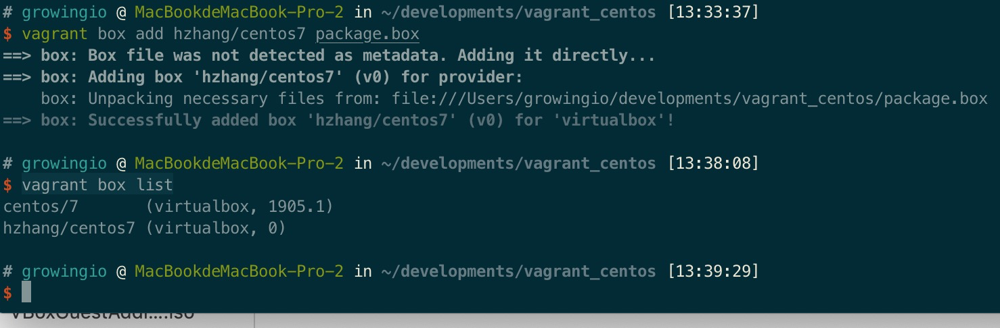

[toc]

# 软件安装

安装都比较简单，下载一直点击Next。

VirtualBox安装：[官网主页](https://www.virtualbox.org/)

Vagrant安装：[官网主页](https://www.vagrantup.com/)

# 虚拟机基础配置

## 虚拟机创建

查看命令与子命令帮助文档：
==vagrant -h==
==vagrant COMMAND -h==
box子命令： ==vagrant box <subcommand> -h==

1. 到VirtualBox上找到一个自己需要的虚拟机，这里使用==centos/7==


2. 初始化并启动虚拟机

``` shell
# 创建初始化目录
mkdir -p vagrant_centos;
# 添加镜像，并输入选择自己的虚拟平台，这里选择3，virtualbox
vagrant box add centos/7;
# 进入vagrant目录，查看可用box并初始化启动
cd vagrant_centos;
vagrant box list;
vagrant init centos/7;
vagrant up
# 命令行直接登录虚拟机
vagrant ssh
```


3. ssh登录，先试用命令查看默认ssh配置：==vagrant ssh-config==


``` shell
# ssh使用默认的秘钥登录
# -p 2222	指定端口
# vagrant	登录角色
# 127.0.0.1	虚拟机IP
# -i	指定秘钥
ssh -p 2222 vagrant@127.0.0.1 -i /Users/growingio/developments/vagrant_centos/.vagrant/machines/default/virtualbox/private_key
```

5. 常用启停管理命令

**启动**：vagrant up
**停止**：vagrant halt
**暂停**：vagrant suspend
**恢复**：vagrant resume
**重启**：vagrant reload
**销毁**：vagrant destroy


## 共享目录

1. 基础共享目录

``` shell
# 项目虚拟机所在的目录就是默认的共享目录，不过文件的共享需要虚拟机重启
mkdir test
echo "This is a test shared file." > test/file;
```


2. 自定义共享目录

**需要先安装**virtualbox guest addtions，否则会报错==mount: unknown filesystem type 'vboxsf' #F44336==

- ubuntu系统处理方案

``` shell
# 进入虚拟机
vagrant ssh
sudo apt-get update;
sudo apt-get install virtualbox-guest-utils;
```

- Mac处理方案

``` shell
# 进入虚拟机
vagrant ssh
sudo yum update -y;
sudo yum install gcc kernel-devel -y; 
# 关闭虚拟机
vagrant halt
# 到http://download.virtualbox.org/virtualbox 最新版本目录下下载 MacOSVBoxGuestAdditions.iso文件
# 按如图步骤添加软驱，在弹出框选择 VBoxGuestAdditions.iso

# 启动虚拟机并登陆
vagrant up;
vagrant ssh;
# 切换到root
sudo su - root;
mkdir -p /media/cdrom;
# 查看软驱列表并挂载，注意软驱名字
lsscsi;
mount /dev/sr0 /media/cdrom;
# 安装扩展包
cd /media/cdrom;
sudo ./VBoxLinuxAdditions.run;
```


==处理完成之后便可以设置共享了==

``` shell
# Vagrantfile文件定位到config.vm.synced_folder所在行，编辑信息
# ../data	本机目录
# /vagrant_data	虚拟机目录
# 创建以及权限
config.vm.synced_folder "../data", "/vagrant_data", create:true, owner:"root", group:"root"

# vagrant重启机器
vagrant reload
```


# 配置网络

私有网络：需要与本机网络位于==不同网段==
公有网络：需要与本机网络位于==同一网段==

## 配置私有网络

1. 修改文件Vagrantfile，将config.vm.network "private_network"这一行修改为自己希望使用的IP
2. 重启虚拟机`vagrant reload`


3. 网络通畅测试与ssh登录


## 配置公有网络

1. 修改文件Vagrantfile，将config.vm.network "public_network"取消注释，如果需要静态IP，需要与本地电脑同网段。
2. 重启虚拟机`vagrant reload`


3. 网络通畅测试与ssh登录


# 打包box与添加box

## 打包box

``` shell
# 进入项目目录启动虚拟机
vagrant up
# 切换root，修改语言环境
vagrant ssh
sudo su - root
echo 'LANG="en_US.UTF-8"' > /etc/sysconfig/i18n
# 并删除rules文件（打包布置的时候以防网络冲突）
ls /etc/udev/rules.d/*
sudo rm -f /etc/udev/rules.d/60-vboxadd.rules
exit
# 打包虚拟机为box文件
vagrant package
```


## 添加box

``` shell
# 添加打包后的.box文件到box列表
# hzhang/centos7 为自定义的box名称
# package.box 为要添加的box文件
vagrant box add hzhang/centos7 package.box
# 查看box列表
vagrant box list
```



## 使用打包的box

``` shell
# 创建新的项目目录
cd ..; mkdir vagrant_hzhang; cd vagrant_hzhang;
# 使用刚从文件导出的box初始化项目
vagrant init hzhang/centos7;
# 启动
vagrant up
# 
```


# 多主机

``` shell
# 修改Vagrantfile文件，定义多虚拟机
  config.vm.define "hadoop101" do |hadoop101| end
  config.vm.define "hadoop102" do |hadoop102| end
  config.vm.define "hadoop103" do |hadoop103| end
  
# 查看所有虚拟机状态
vagrant status
# 启动虚拟机，vagrant up启动所有虚拟机，vagrant up [NAME]启动指定名称虚拟机。
vagrant up
```


## 多主机的网络配置


