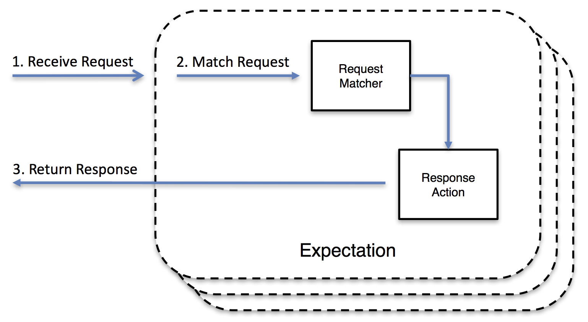
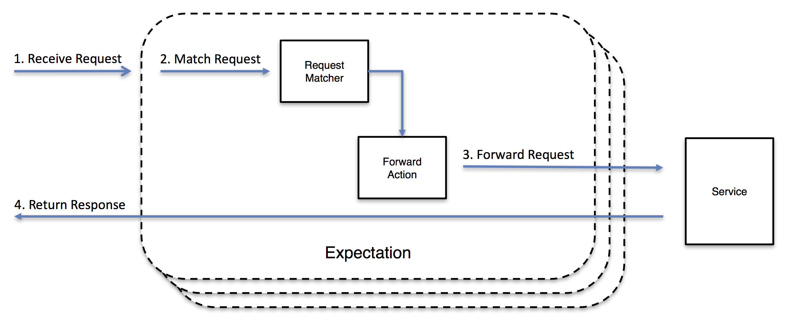
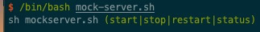
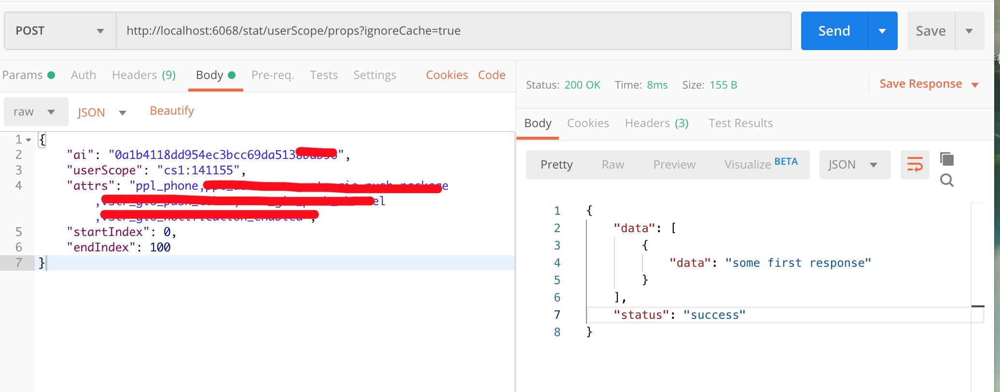
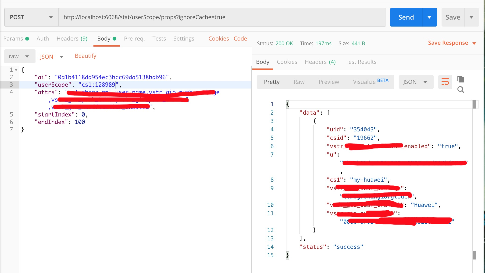
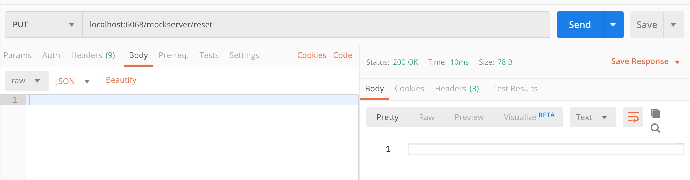
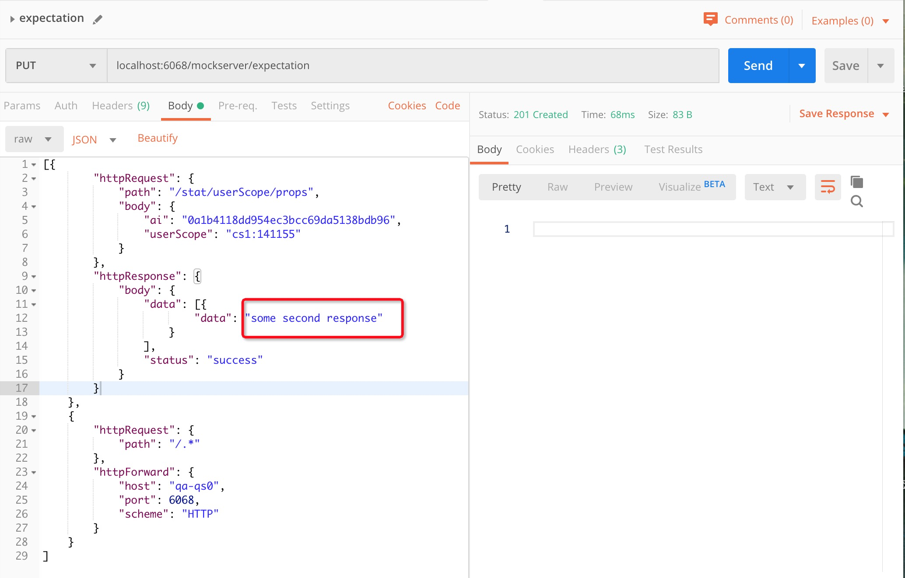
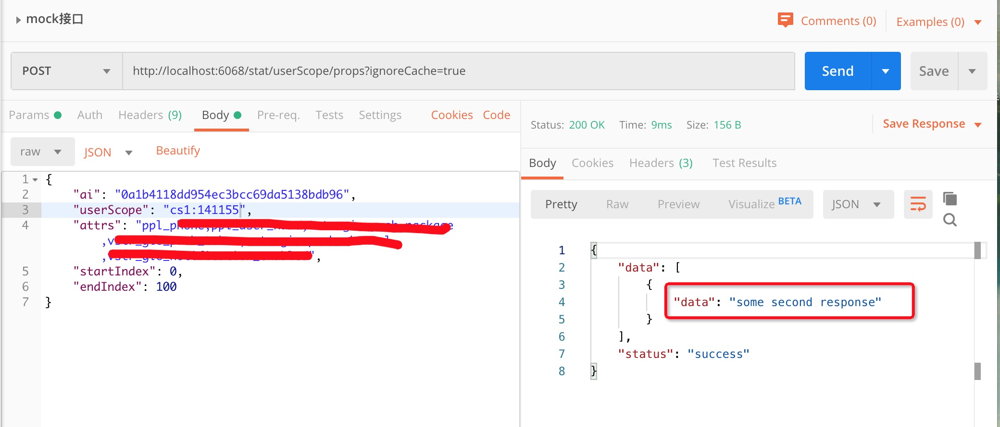

> 接口测试与界面测试过程中，会存在期望请求返回预期结果；非期望请求接口数据正常返回的场景。使用mock-server可以满足如下：
> 1. 涉及数据查询接口，根据数据查询返回决定后续操作。避免修改数据库造成数据污染。
> 2. 指定某些测试请求，可以对期望进行匹配，其余进行转发。将正常使用接口mock数据指定到某个case。
> 记录一下测试过程中用到的mock-server，更多内容查看官网教程

[toc]

## 工具选用

使用mock-server，主要用到了其中的3个功能：期望匹配、模拟相应、请求转发

[mock-server官网](http://www.mock-server.com/#what-is-mockserver)





## 安装mock-server


### 1. 启动方式

mock-server的安装方式比较多，这里使用比较简单的jar包直接在服务器上启动（需要java环境）。

``` shell
java -jar <path to mockserver-jetty-jar-with-dependencies.jar> -serverPort <port> [-proxyRemotePort <port>] [-proxyRemoteHost <hostname>] [-logLevel <level>]

# -serverPort <port> 代理监听端口
# -proxyRemotePort <port> 不符合期望的转发到指定端口
# -proxyRemoteHost <hostname> 不符合期望的转发到指定ip
# -logLevel <level> 日志级别：TRACE, DEBUG, INFO, WARN, ERROR, OFF or Java Logger levels: FINEST, FINE, INFO, WARNING, SEVERE or OFF。可以不从命令行指定，使用-Djava.util.logging.config.file="日志配置文件"来指定java自带日志java.util.logging的配置文件指定日志
```

### 2. 设置期望

**设置期望有两种方式**：
1. 在==启动服务时 #F44336==使用 ==-Dmockserver.initializationJsonPath="期望配置文件"== 指定期望（期望文件可以放在zookeeper或者consul每次启动使用命令获取）。
2. 在==服务启动后 #F44336==使用自带接口:/reset、/expectation管理。接口文档地址：[mock-server接口文档](https://app.swaggerhub.com/apis-docs/jamesdbloom/mock-server-openapi/5.8.x#/control/put_retrieve)

**期望配置文件参数**：

1. 期望从上到下依次匹配
2. 期望支持正则
3. 请求body包含期望body参数即为匹配，详细参数见期望配置文档：[期望配置文档](https://app.swaggerhub.com/apis-docs/jamesdbloom/mock-server-openapi/5.8.x#/Expectation)
4. 返回指定任意类型或者转发。

``` json
[{
        "httpRequest": { # 期望1
            "path": "/stat/userScope/props", # 请求路径匹配,支持正则
            "body": { # 请求体匹配
                "ai": "0a1b4118dd954ec3bcc69da5138bdb96",
                "userScope": "cs1:141155"
            }
        },
        "httpResponse": {
            "body": {
                "data": [{
                        "data": "some first response"
                    }
                ],
                "status": "success"
            }
        }
    },
    {
        "httpRequest": {# 期望2
            "path": "/.*" 
        },
        "httpForward": { # 代理转发请求
            "host": "qa-qs0",
            "port": 6068,
            "scheme": "HTTP"
        }
    }
]
```

### 3. 编写shell脚本管理

使用shell脚本启动停止服务也可以将mock-server配置到systemctl。脚本是centos下写的比如netstat命令与macos有点冲突，所以在macos下使用可能有点问题。

[百度云盘下载地址](https://pan.baidu.com/s/1GYDaNjFF8IwvA-1q5dwp9g)



``` shell
# 目录结构
mockserver
├── conf
│   ├── logging.properties
│   └── mock-server.json
├── lib
│   └── mockserver-netty-5.8.1-jar-with-dependencies.jar
├── log
│   ├── mock-server.log.0
│   └── mock-server.log.0.lck
└── mock-server.sh
```

## 测试与附件

### 1. 测试期望





### 2. 通过接口管理期望







### 3. logging.properties例子

``` prolog
# To use this file set System Property on JVM as follows: -Djava.util.logging.config.file=/path/to/logging.properties
# Logging
handlers = java.util.logging.FileHandler, org.mockserver.logging.StandardOutConsoleHandler
.level = ALL

org.mockserver.level = INFO
io.netty.handler.ssl.SslHandler.level = WARNING
java.util.logging.SimpleFormatter.format = %1$tF %1$tT  %4$s  %5$s %n

# File Logging
java.util.logging.FileHandler.pattern = log/mock-server.log
java.util.logging.FileHandler.formatter = java.util.logging.SimpleFormatter
java.util.logging.FileHandler.limit=50000
java.util.logging.FileHandler.count=3
java.util.logging.FileHandler.level=DEBUG
java.util.logging.FileHandler.append=true

# Console Logging
org.mockserver.logging.StandardOutConsoleHandler.level = ALL
org.mockserver.logging.StandardOutConsoleHandler.formatter = java.util.logging.SimpleFormatter
```

