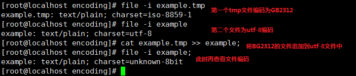
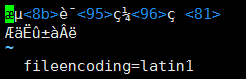
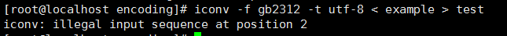
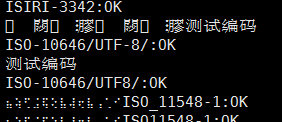
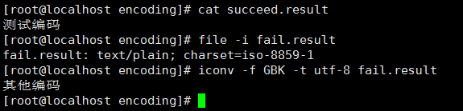

----------

> 文件中存在多行编码不一致的情况，这个时候对整个文件的编码转换报错导致的编码转换失败，这里做一个总结。

[toc]

# 文件示例

可能产生的原因



此时文件内容




# 转换示例

文件中存在有些行使用的编码字符集不一致的情况，这个时候如果使用iconv直接对文件转换编码会报错。



1. 如果能使用file命令直接查看出来文件的编码格式，通过iconv命令转换基本就不会报错了。
2. 确定某些行的格式，循环文件每行进行转换，对无法转换的行单独输出到一个文件中，然后再确定无法转换的文件的格式。

``` shell
# 指定需要转换的文件
export file="example";
# 抽取文件中的一行来确定本行文件的编码
firstLine=`sed -n '1p' "${file}"`; for coded in `iconv --list | sed 's/\/\/$//' | sort`; do echo "${firstLine}" | iconv -f "${coded}" -t utf-8 && echo "${coded}:OK"; done | tee encoding.result;
```

3. 此时去查看encoding.result中对文本第一行转换完成之后的文本编码。



4. 通过上一行确定的utf-8转换文件输出到succeed.result，然后转换失败的输出到fail.result（遍历文件每行转换）。

``` shell
# 遍历文件每一行转换
while read line; do echo "${line}" | iconv -f utf-8 -t utf-8 >> succeed.result || echo "${line}" >> fail.result; done < ${file} &
```

5. 转换完成之后（GBK等为GB8030子集的编码都可用GB18030转换）



6. 对于大文件转换特别慢，可以用split切换为多个文件，对部分文件直接针对文件转换，失败的再使用遍历逐行转换。

``` shell
# 定时查看文件是否转换完成一直转换之后的行数（PID替换为4步骤中的shell返回的pid）
watch -n 5 "ps -ef | grep -v grep | grep PID; [ -f succeed.result ] && wc succeed.result; [ -f fail.result ] && wc fail.result;";
```
