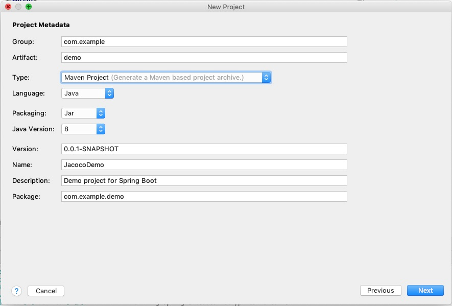
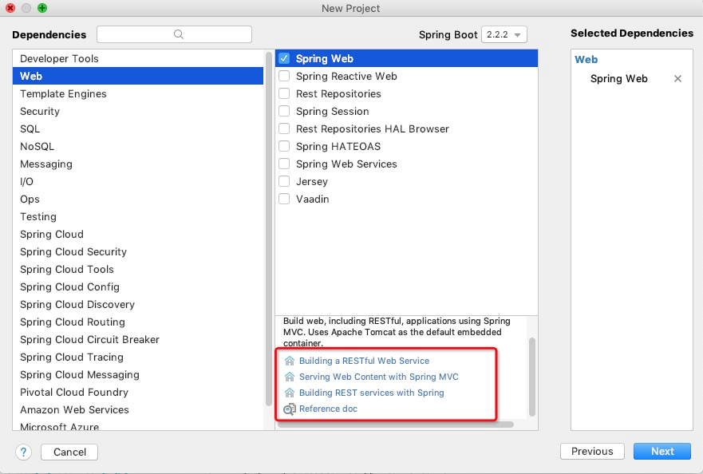
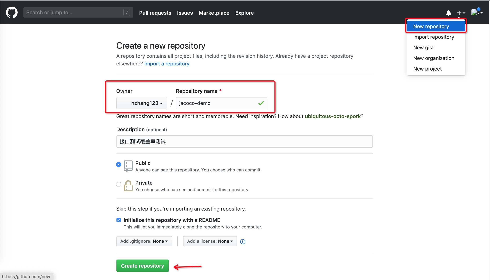

> 需求：统计微服务接口测试的代码覆盖率
> 1. JaCoCo的ant与maven方法都是在编译期对单元测试的覆盖率统计
> 2. JaCoCo的可以开启一个agent服务收集运行过程中的代码执行覆盖率。
> 主要会用到jacoco 的两个功能：agent和cli

[toc]

## 覆盖率收集

### 1. 收集方式

鉴于接口测试是在微服务启动后运行的测试，所以在选用第二种agent的测试，会有两个比较麻烦的地方（列出了自己比较笨拙的解决方法）
1. 源码获取：去git上再拉取一遍。
2. 编译后字节码获取：按照测试环境构建再统计过程中再构建一遍。

统计覆盖率过程基本如：
1. 微服务启动，同时启动agent收集覆盖率
2. 接下来基本都是jenkins任务需要做的
 - git获取项目源码
 - 使用构建工具编译源码
 - 使用cli工具获取JaCoCo覆盖率统计文件
 - 使用cli工具根据exec文件生成覆盖率报告

### 2. JaCoCo使用

参考jacoco官方使用文档：[官方文档索引](https://www.jacoco.org/jacoco/trunk/doc/integrations.html)、[agent帮助文档](https://www.jacoco.org/jacoco/trunk/doc/agent.html)、[cli帮助文档](https://www.jacoco.org/jacoco/trunk/doc/cli.html)

- **JaCoCo官方给出了3种收集覆盖率文件的方式**：file、tcpserver、tcpclient。

在JVM虚拟机启动时加入参数： ==-javaagent:[yourpath/]jacocoagent.jar=[option1]=[value1],[option2]=[value2] #E91E63== ， 实例如下：

``` shell
# Example: 输出到文件，在JVM终止时，执行数据被写入本地文件。接口测试不会考虑这种情况（单测一般是用这种）
# 1. 服务终止影响整个测试环境。
# 2. 有些跨环境的服务，获取微服务所在机器上的文件也比较麻烦。
-javaagent:~/jacoco-0.8.5/lib/jacocoagent.jar=includes=*,output=file,append=true,destfile=~/jacoco-0.8.5/jacoco.exec

# Example: 输出到tcpserver，使用工具连接到JVM，获取dump数据。使用这种方式不需要停止jvm，也直接可以通过网络传输。但是远程连接没有任何身份验证机制，所以生产环境一定要确保只有信任的人可访问jacoco地址。配合jacoco cli获取数据。
-javaagent:~/jacoco-0.8.5/lib/jacocoagent.jar=includes=*,output=tcpserver,append=true,address=127.0.0.1,port=6301

# 列出部分参数，
# includes：插桩的代码类名列表，使用:分割，也可以使用*和?匹配，但是不考虑性能的情况下一般不需要使用。默认为*
# output：用于写入coverage数据的输出方法。有效选项包括：file、tcpserver、tcpclient、none
# append：如果文件已经存在则追加到已存在文件中，如果为false则替换
# destfile：输出exec文件的路径
# address：配合tcpserver来指定对外开放的jacoco访问地址。如果配置的127.0.0.1或localhost则只能本地访问dump数据
# port：配合tcpserver来指定对外开放的jacoco端口。端口不能被占用
```

- **JaCoCo命令行界面**：命令行界面提供了基本的操作，基本能满足接口覆盖率报告的生成；dump数据与生成报告都使用cli。

``` shell
# Example：获取jacoco server对外开放地址的数据。
# --address jacoco tcpserver地址，网络要通不然啥都白搭。
# --port jacoco tcpserver端口
# --destfile dump数据存储位置
java -jar ${jacoco_home}/lib/jacococli.jar >>==dump==<< --address ${address} --port ${port} --destfile ${destfile}

# Example：使用获取到的exec文件生成覆盖率报告。
# --classfiles 必须指定，源码编译后target目录文件。（这也是jenkins任务在单独拉取源码执行编译的原因）
# --sourcefiles 源码，非必须项。不指定无法查看代码执行详细情况。
# --html html报告生成目录
java -jar ${jacoco_home}/lib/jacococli.jar >>==report==<< ${destfile} --classfiles ${classfiles} --sourcefiles ${sourcefiles} --html reportdir
```

==接下来创建一个项目实验一下==

## Sprint Boot测试项目

### 1. 创建项目






### 2. 工程结构

``` feature
src
├── main/
│   ├── java/
│   │   └── com/
│   │       └── example/
│   │           └── demo/
│   │               ├── JacocoDemoApplication.java
│   │               └── controller/
│   │                   └── CountController.java >>==测试controller==<<
│   └── resources/
│       ├── application.properties
│       ├── static/
│       └── templates/
└── test/
    └── java/
        └── com/
            └── example/
                └── demo/
                    └── JacocoDemoApplicationTests.java
```

### 3. CountController.java

``` java
package com.example.demo.controller;

import org.springframework.web.bind.annotation.*;

import java.util.Map;

@RestController
public class CountController {

    @RequestMapping(value = "/test1", method = RequestMethod.POST)
    @ResponseBody
    public boolean caseCount(@RequestBody Map<String, Integer> params) {
        if (params.get("count") > 0) {
            return true;
        } else {
            return false;
        }
    }

    @RequestMapping(value = "/test2", method = RequestMethod.POST)
    @ResponseBody
    public boolean caseCount1(@RequestBody Map<String, Integer> params) {
        if (params.get("count") > 0) {
            return true;
        } else {
            return false;
        }
    }
}

```

### 4. 上传代码到github




``` shell
# 进入项目目录，初始化项目
git init
# 新增修改文件。
git add .
# 按照上一步提示使用命令设置本项目的账户（也可以加--global设置全局）
git config --local user.email '***'
# 提交本次新增内容
git commit -m 'jacoco 代理统计覆盖率demo代码'
# 设置代码库地址
git remote add origin https://github.com/hzhang123/jacoco-demo.git
# 获取项目初始化的README.md文件
git pull --rebase origin master
# 上传到github。 >>==可能会让输入用户名密码==<<
git push -u origin master
```

## 覆盖率统计测试

我这里全部是本地项目，所以都用的本地127.0.0.1

### 1. 启动项目

- 添加参数启动项目


- postman 发送测试请求


### 2. jenkins任务

- 添加流水线任务


- 添加string参数


- Pipeline script

只是测试，所以pipeline脚本中有有一些参数我直接写死了，比如：GIT_BRANCH、CODE_REPO、jacoco_home、classfiles、sourcefiles，可以根据不同项目配置一下构建参数。

``` groovy
#!/usr/bin/env groovy

pipeline {
    agent any

    environment {
        // 如果scala构建使用sbt，jenkins兼容不太好需要environment中拼接工具地址
        SBT_HOME = tool name: 'sbt1.3.0', type: 'org.jvnet.hudson.plugins.SbtPluginBuilder$SbtInstallation'
        PATH = "${env.SBT_HOME}/bin:${env.PATH}"
        // 可以添加构建参数用来指定获取分支等信息
        GIT_BRANCH = "master"
        CODE_REPO = "https://github.com/hzhang123/jacoco-demo.git"
    }
    tools {
        // 引入tools中配置的工具
        maven "maven3.6.1"
        jdk 'jdk1.8.0_231'
    }
    stages {
        stage('Clone & Build') {
            steps {
                deleteDir()
                git branch: env.GIT_BRANCH, url: CODE_REPO
                // 如果有Phabricator & Arcanist工具可以配合review与打patch
                // script {
                //     diffs = DIFFS.trim().toUpperCase().split("(\\s+|\\s*,\\s*)")
                //     for (i = 0; i < diffs.length; i++) {
                //         id = diffs[i];
                //         if (id.trim().length() > 0) {
                //             sh "arc patch ${id}"
                //             sh "git checkout ${GIT_BRANCH}"
                //             sh "git merge arcpatch-${id}"
                //         }
                //     }
                // }
                sh "mvn clean package"
            }
        }
        stage('Exec & Report') {
            steps {
                sh '''
                # JaCoCo依赖在jenkins上的地址
                jacoco_home="/Users/growingio/developments/tools/jacoco-0.8.5"
                # ----------------
                # dump tcp端口数据
                # ----------------
                address=`echo ${server_addr} | awk -F: '{print $1}'`
                port=`echo ${server_addr} | awk -F: '{print $2}'`
                destfile=target/JacocoDemo.exec
                java -jar ${jacoco_home}/lib/jacococli.jar dump --address ${address} --port ${port} --destfile ${destfile}

                # 生成报告
                classfiles="target/classes"
                sourcefiles="src/main/java"
                java -jar ${jacoco_home}/lib/jacococli.jar report ${destfile} --classfiles ${classfiles} --sourcefiles ${sourcefiles} --html report
                '''
            }
        }
        stage('publishHTML & Clean Workspace') {
            steps {
                publishHTML([allowMissing: true, alwaysLinkToLastBuild: true, keepAll: false, reportDir: "report", reportFiles: 'index.html', reportName: 'HTML Report', reportTitles: ''])
                cleanWs()
            }
        }
    }
}
```

### 3. 构建报告

详细参数可以查看官方文档：[代码覆盖率参数文档](https://www.jacoco.org/jacoco/trunk/doc/counters.html)

**Instructions (C0 Coverage)**：JaCoCo 计算的最小单位就是字节码指令。指令覆盖率表明了在所有的指令中指令执行的覆盖率。
**Branches (C1 Coverage)**：JaCoCo还计算所有的for与if分支覆盖率，异常处理不在分支计算范围内。黄色（部分覆盖）、红色（未覆盖）、绿色（全部覆盖）
**Cyclomatic Complexity**：圈复杂度
**Line**：可能一行会被编译为多个指令，所以在源码高亮显示每行代码的情况。黄色（部分覆盖）、红色（未覆盖）、绿色（全部覆盖）
**Methods**：每个方法至少包含一个指令，当改指令被执行时认为方法被执行。
**Classes**：每个类至少包含一个方法，当该方法被执行时认为类被执行。


